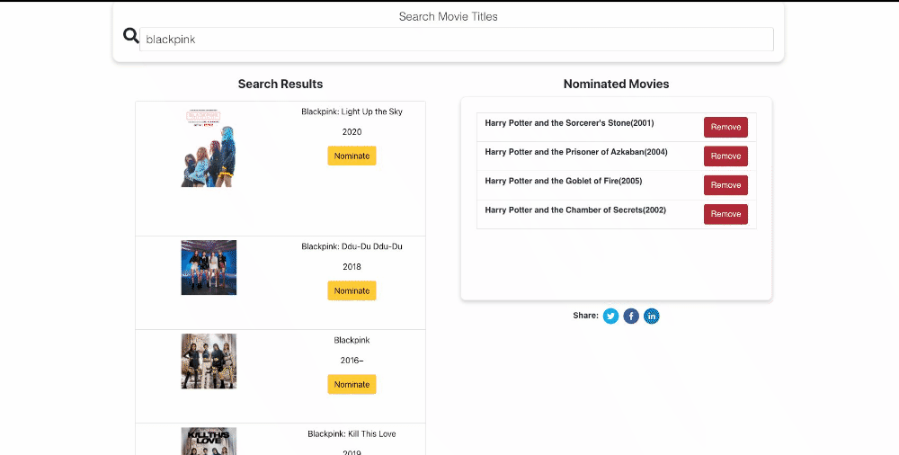
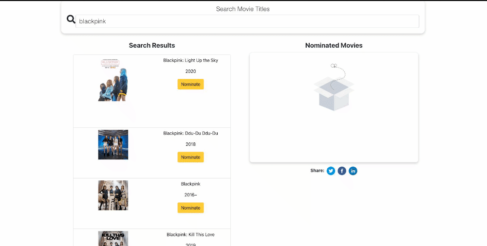
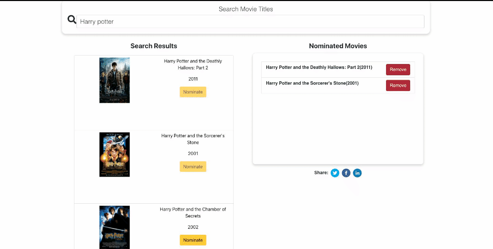
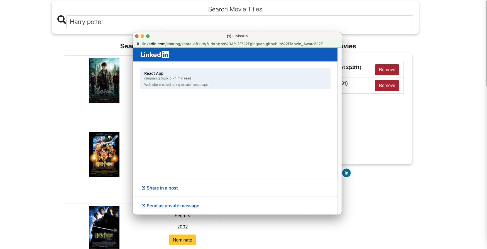
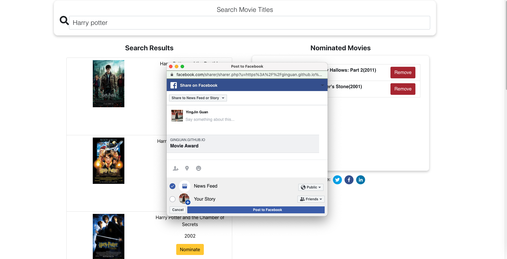

# Movie_Award Web 

### This is a react project:

-  A webpage that can search OMDB for movies, and allow the user to save their favourite movies they feel should be up for nomination (Up to 5 nominations). 

#### Demo: https://ginguan.github.io/Movie_Award/

- Some key features:
    - Using OMDB api for movie searching (has default search options), onChange searching function, click the search box will select all text for changes
    - Animations for info display, empty list (nominated movies and search results)
    - User's choice of nominations is saved at local storage (will display selection when reopen the page)
    - Share link available for Facebook, Twitter, Linkedin, will pop up a share window

### ScreenShot

### Installation
    npm install
    npm start
